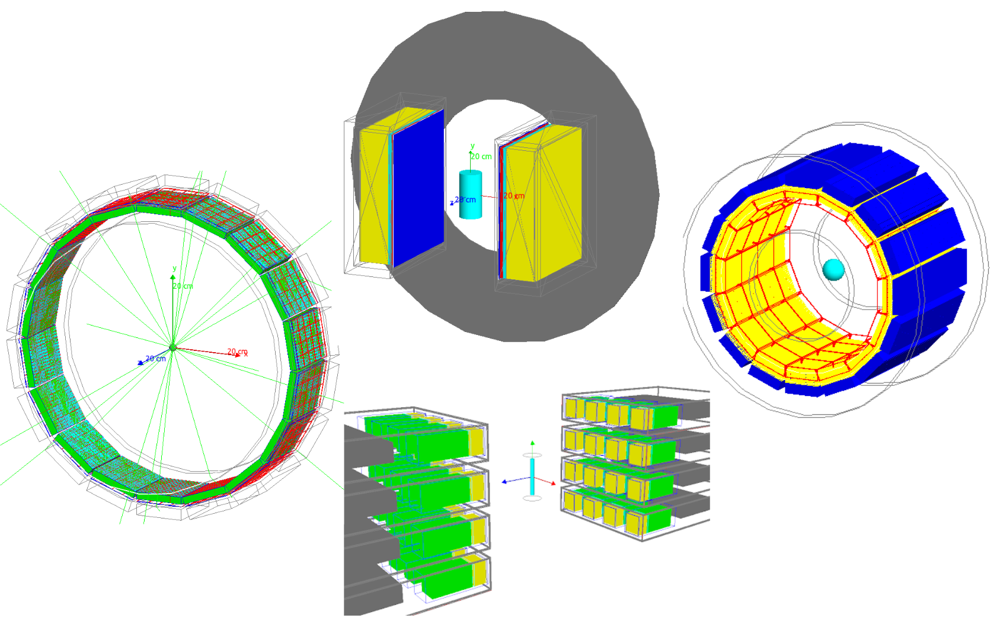

# GATE Models for Positron Emission Particle Tracking Simulations
Geant4 Application for Tomographic Emission (GATE) library of models for detector created by calibration against experimental measurements

