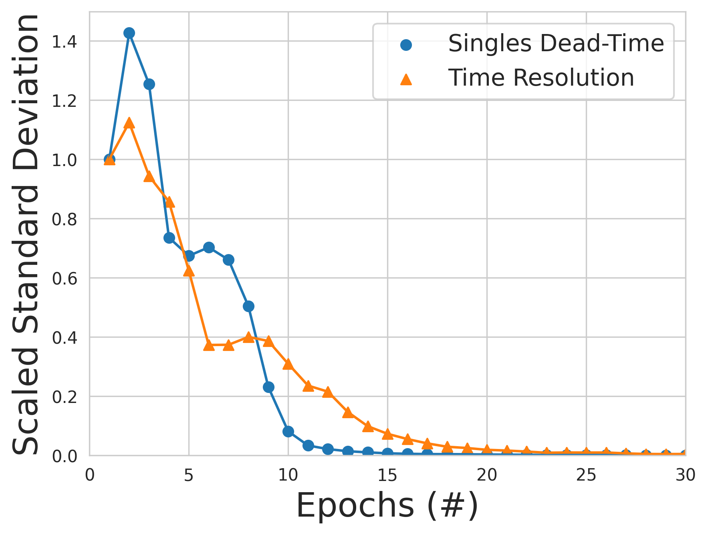
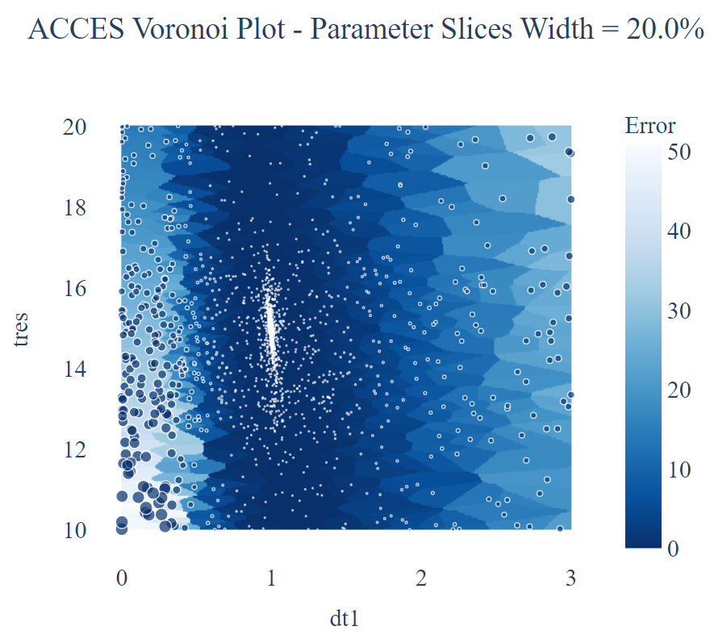

# Simple Optimisation of the GATE model

In this folder you will find all of the codes needed to generate test data and calibrate a GATE model of the ADAC Forte using the SLURM job manager. 

To generate ground truth detector response run: python3 launch

To analyse the ground thrugh response and save the count-rate vs activity curve as 'Countrate_test_525mm.txt' run: python3 analyzeTests.py

To begin the ACCES calibration of the singles dead-time and time resolution run: sbatch run_access_gate.bash

To generate the plots for analysing the results of the optimisation run: sbatch run_access_plot.bash 

